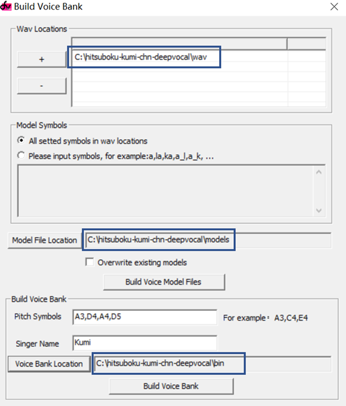

# hitsuboku-kumi-chn-deepvocal
[English](README.md) | **中文**

[Github](https://github.com/oxygen-dioxide/hitsuboku-kumi-chn-deepvocal/blob/main/README_zh.md) | 
[Gitee](https://gitee.com/oxygendioxide/hitsuboku-kumi-chn-deepvocal/blob/main/README_zh.md) | 
[Gitlab](https://gitlab.com/oxygen-dioxide/hitsuboku-kumi-chn-deepvocal/-/blob/main/README_zh.md) | 
[Bitbucket](https://bitbucket.org/oxygendioxide/hitsuboku-kumi-chn-deepvocal/src/main/README_zh.md)

Hitsuboku Kumi (筆墨クミ)是Cubialpha制作的UTAU虚拟歌手。本项目将Hitsuboku Kumi的中文CVVC音源移植到deepvocal引擎。这是Github上首个开源deepvocal音源。

根据Hitsuboku Kumi的[用户协议](https://cubialpha.wixsite.com/koomstar/character)，二次分发，修改oto.ini和音频文件，以及移植到其他合成引擎是允许的，但需要保持名称"Hitsuboku Kumi"不变，注明原作者"Cubialpha"，提供[官网链接](https://cubialpha.wixsite.com/koomstar)，并明确说明你做了编辑。

如果你喜欢这个音源，请给她点一个Star。

## [试听](https://github.com/oxygen-dioxide/hitsuboku-kumi-chn-deepvocal/issues/1)
(花欺~沉睡在浮空的花海，曲：Cube^3，词：雨狸，工程：卦者那啥子靈風)

## 下载
从[Release页面](https://github.com/oxygen-dioxide/hitsuboku-kumi-chn-deepvocal/releases/latest)下载音源

## 技术规格
- 4音阶 (A3, D4, A4, D5)
- 使用飞天胶囊录音表
- 提供dvtb1.1.6和dvtb2.1.0构建的版本
- 尾音：R
- 喉塞音：!（来自[Hitsuboku Kumi 日文Act4](https://cubialpha.wixsite.com/koomstar/act4)），例如"!a" "a_!"
- 气泡音：'（来自[Hitsuboku Kumi 日文Act4](https://cubialpha.wixsite.com/koomstar/act4)），例如"'a" "a_'"
- 独立辅音（仅dv1版本支持）：p, f, t, k, q, x, c, s, ch, sh, r

详见[特性列表](feature.md)

## 对音频的修改
- 音量已被标准化到-9db

## 自行编译音源
1. 用以下命令下载源文件：
```
git clone https://github.com/oxygen-dioxide/hitsuboku-kumi-chn-deepvocal
```

2. 下载并安装[deepvocal toolbox](https://dl.deep-vocal.com/toolbox/Setup_DeepVocalToolBox_beta_2.1.0.zip)

3. 用deepvocal toolbox打开kumi.dvtb，点击“Function→Build voice bank”，将wav locations、model file location和voice bank location均设为下载位置。
例如，如果你将项目下载到了C:\hitsuboku-kumi-chn-deepvocal,则你需要如图设置：


4. 点击“Build Voice Model Files”，编译音源。

5. 点击“Build Voice Bank”，打包音源。

## 相关链接
[Deepvocal 官网](deep-vocal.com)

[Deepvocal toolbox 使用说明](https://share.weiyun.com/5snXMol)

[Deepvocal标记工具（DVMT）仓库](https://github.com/FangCunWuChang/DeepVocal-Mark-Tool)

[Hitsuboku Kumi官网](https://cubialpha.wixsite.com/koomstar)