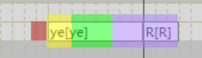
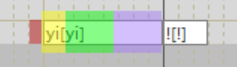
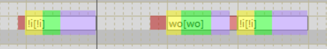
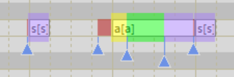

# 特性列表

## 音阶
|软件内显示音阶|录制音高|
|-|-|
|T1|A3|
|T2|D4|
|T3|A4|
|T4|D5|

T4音阶为假声

## 常规音素
使用飞天胶囊录音表，与Risku CVVC表相比，合并了部分辅音音素。

### 常规辅音：
``` 
b p f d t g k h j q x z c s zh ch sh r m n l y w yw
```
- yw为yu yuan yue yun的辅音
- Hitsuboku Kumi的r发音接近于卷舌浊擦音ʒ（television中的s）

### 常规元音韵尾：
```
a ai an ang ao o ou ong e ei en eng e0 en0 i in ing u v vn i0 ir er
```
- e0为ye的元音
- en0为yan的元音
- i0为zi ci si的元音
- ir为ri zhi chi shi的元音

## 特殊音素
### 语尾息 R
支持所有拼音，在音符后面加一个"R"音符来调用



### 喉塞音 !
喉塞音采样来源于[Hitsuboku Kumi 日文Act4](https://cubialpha.wixsite.com/koomstar/act4)，因此不支持所有拼音。有两种调用方式：
- 句尾调用：在音符后面加一个"!"音符，支持a i e0 o韵尾



- 开头或句中调用："!+元音"，支持!a !ai !an !ang !ao !i !in !ing !e0 !ei !en0 !o !ou !ong



### 气泡音 '（开发版特性）
与喉塞音类似，气泡音采样来源于[Hitsuboku Kumi 日文Act4](https://cubialpha.wixsite.com/koomstar/act4)，因此不支持所有拼音，调用方式与喉塞音相同。
- 句尾调用：在音符后面加一个"'"音符，支持a i e0 o韵尾

- 开头或句中调用："'+元音"，支持'a 'ai 'an 'ang 'ao 'i 'in 'ing 'e0 'ei 'en0 'o 'ou 'ong

只有T1音阶提供气泡音采样。

### 独立辅音
由于dvtb2的bug，只有dvtb1构建版才支持独立辅音

支持 p, f, t, k, q, x, c, s, ch, sh, r

单独调用，如果紧跟在常规音符后面，将调用对应VC部



这一特性可用于跨语种、bbox